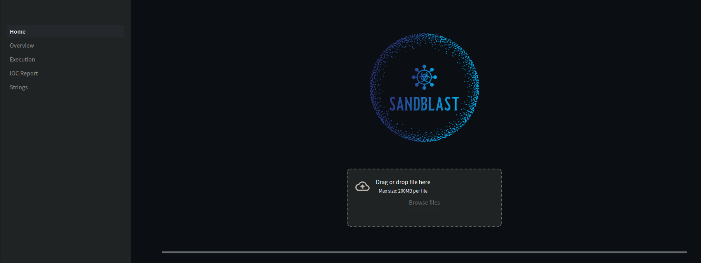

<div align="center">
  

  <br/>

  <p><i>Sandblast is a modern malware triaging tool built as an easily deployable container</i></p>
  <br />
  
  <h3> Powered by </h2>
  
  ---
  
  <div>
    
    
    
    
  </div>
  
</div>

---

# Installation

```
docker pull elusivethreat/sandblast

docker run -it -p 8501:8501 sandbox:latest
```

# Usage

Navigate to `localhost:8501` in your web browser to access the Sandblast. Upload your file to start analysis and use the side-pane to navigate through the reports.

